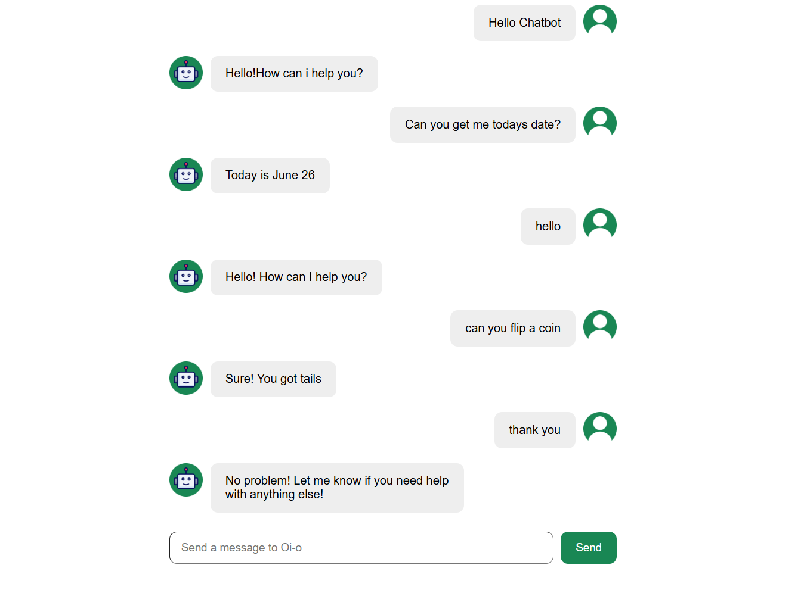

# ChatBot

A simple and responsive chatbot application built with **React**. This project was created as part of my React learning journey to practice component-based architecture, props, state management, and modern frontend development.

## Preview

<p align="center">
  
</p>

## Features

- Clean and responsive user interface
- Real-time chat interface
- Reusable React components
- Modern React practices
- Easy to understand and extend

## Tech Stack

- React
- JavaScript (ES6+)
- CSS3
- Vite

## Project Structure

```
ChatBot/
├── public/
├── src/
│   ├── assets/
│   ├── components/
│   ├── App.jsx
│   ├── main.jsx
│   └── ...
├── package.json
├── vite.config.js
└── README.md
```

## Getting Started

### Prerequisites

- Node.js
- npm

### Installation

1. Clone the repository

```bash
git clone https://github.com/YOUR_USERNAME/ChatBot.git
```

2. Navigate to the project directory

```bash
cd ChatBot
```

3. Install dependencies

```bash
npm install
```

4. Start the development server

```bash
npm run dev
```

The application will be available at:

```
http://localhost:5173
```

## Learning Objectives

This project helped me practice:

- Building reusable React components
- Managing component state
- Passing data using props
- Organizing a React project
- Styling React applications
- Working with Vite

## Future Improvements

- AI-powered responses
- Dark mode
- Chat history
- Typing indicator
- Authentication
- Backend integration
- Mobile-first enhancements

---
